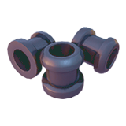

# 7days-mods
Mods for 7 Days to Die

## Installation

### Linux

```bash
git clone https://github.com/christianhujer/7days-mods.git
ln -s $(realpath 7days-mods/MoreMods) ~/steam/steam/steamapps/common/7\ Days\ To\ Die/Mods/
```

### Windows
1. Clone https://github.com/christianhujer/7days-mods.git using git
1. Copy the `MoreMods` directory to your `Mods/` directory of your _7 Days to Die_ installation.

## MoreMods
More mods for armor, weapons, and vehicles.

<table>
<thead>
<tr><th>Sybmol</th><th>Description</th></tr>
</thead>
<tbody>
<tr><td></td><td>Kevlar Armor Plating<br/>Kevlar is so much better than steal.</td></tr>
<tr><td></td><td>Profiled Fittings<br/>Ever wondered what combinding tailoring and science looks like? Your clothes never felt more comfortable.</td></tr>
<tr><td></td><td>Profiled Muffled Connectors<br/>Science the shit out of this noise. Noise? Which noise?</td></tr>
</tbody>
</table>

The corresponding schematics are included and added to the relevant loot groups as well as traders.

Also, this mod adds/enables:
* The already included Blessed Metal mod, but changes its crafting recipe to include silver nuggets.
* Crafting (recipe) of an army ammunitions box.
